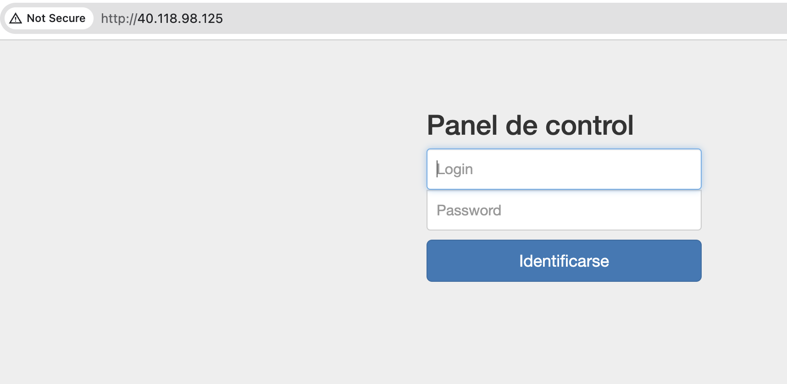
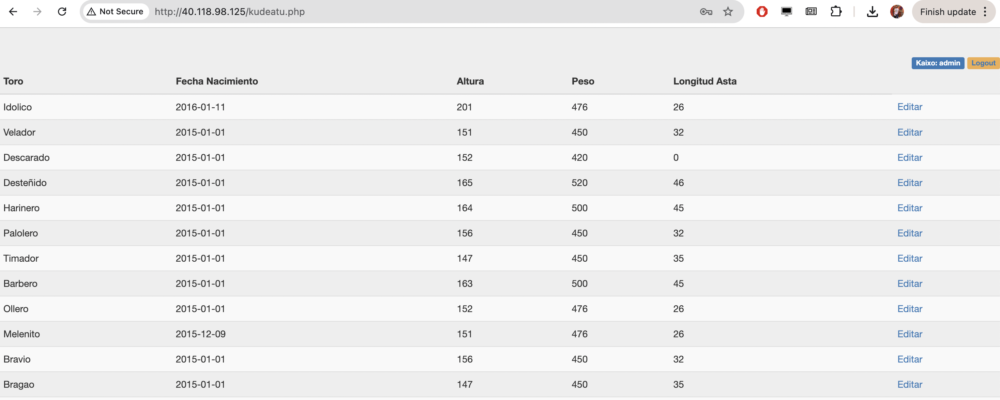

Ejercicios:

1. Clona el siguiente repositorio y sigue las instrucciones del [README.md](https://github.com/juananpe/zezenak) para instalar y ejecutar el sistema de información ("Aplicación de Gestión de Ganadería")
en local: https://github.com/juananpe/zezenak

2. Clona el repositorio en tu máquina remota (Azure, p.ej.) de tal forma que sea accesible vía http://TU_IP
   (sigue las instrucciones que encontrarás en este documento compartido sobre configuración de [máquinas virtuales en Azure](https://docs.google.com/document/d/14XDfS6OTW7XIK5vrgZgV7d_hKuZ0avUsj3lTeglX1cI/edit?usp=sharing)) 
   
   Nota: NO instales nginx.
   - Genera una `clave SSH`
   - Crea una máquina Ubuntu (asocia la clave ssh a esta máquina)
   - Abre los puertos 80, 443 y 22
   - Crea un archivo `zip` con los ficheros del repositorio zezenak ("Gestión de Ganadería").
   
   Sitúate en el directorio donde esté la aplicación:
   
      `zip -9 -r zezenak.zip *`

   - Usa el comando `scp` para copiar el el fichero zip de la aplicación zezenak a tu máquina Azure.
   (Asegúrate de que estás situado en el mismo sitio que tu certificado pem)
   ```
   local$ scp -i azure-key-2024.pem /ruta/a/zezenak.zip azureuser@IP_DE_MAQUINA_AZURE:/tmp
   ```

   - Conéctate por ssh a tu máquina Azure y ejecuta los siguientes comandos en la terminal de tu máquina en Azure.

   - Instala el comando `unzip`
   ```
   $ sudo apt update
   $ sudo apt install unzip
   ```
   
   - Crea un directorio sgss en tu carpeta raíz de usuario:
   ```bash
   $ cd 
   $ mkdir sgssi
   ```

   Descomprime el fichero zip en ~/sgssi :

   ```bash
   $ unzip -d ~/sgssi /tmp/zezenak.zip
   ```

   - Instala docker
   ```bash
   $ cd
   $ curl -fsSL https://get.docker.com -o get-docker.sh
   $ sudo sh ./get-docker.sh
   ```
 
   - Configura docker para permitir su ejecución como usuario no-root:
 
  ```bash
  $ sudo groupadd docker
  $ sudo usermod -aG docker $USER
  $ newgrp docker
  ```

- Verifica que puedes ejecutar docker como un usuario sin privilegios de administración:
```bash
$ docker run hello-world
```
Deberías de ver un mensaje como el siguiente:

```
$ docker run hello-world
...
Hello from Docker!
```

- Lanza la aplicación de gestión de ganadería:
```bash
$ cd ~/sgssi
$ docker compose up
```
Abre un navegador apuntando a la dirección IP de tu máquina en Azure. Deberías de ver algo como esto:



Identifícate en el panel de control con las credenciales por defecto: `admin/P4ssw0rd`

Deberías de ver algo como esto:


- Cierra la terminal donde tienes lanzado el comando docker. Intenta conectarte de nuevo a través del navegador. Verás que al cerrar la terminal el servidor web se ha parado. Para evitar que docker cierre los servicios al cerrar la terminal, es necesario lanzar el comando docker con la opción `-d`:
```
$ docker compose up -d
```
(-d: opción 'daemon', lanza el proceso en modo servidor, evitando el cierre de la conexión al cerrar la terminal que originó el proceso)

3. Reflexiona:

¿Qué harías si cambias el contenido de algunos ficheros en local y quieres sincronizar sólo los ficheros que han cambiado? Piensa que en tu aplicación puede haber cientos de ficheros...

¿Cómo evitar tener que hacer un zip cada vez que quieras sincronizar algo?

¿Está el fichero `babeskopia.sql` en la misma carpeta que `index.php`? ¿Qué problema de seguridad puede generar subir ese fichero?

**GLOSARIO**

- git
- ssh
- scp
- zip
- unzip
- apt
- mkdir
- cd
- curl
- sh
- sudo
- groupadd
- usermod
- newgrp
- docker
- docker compose