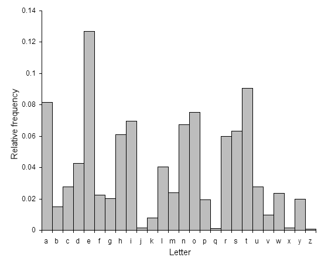
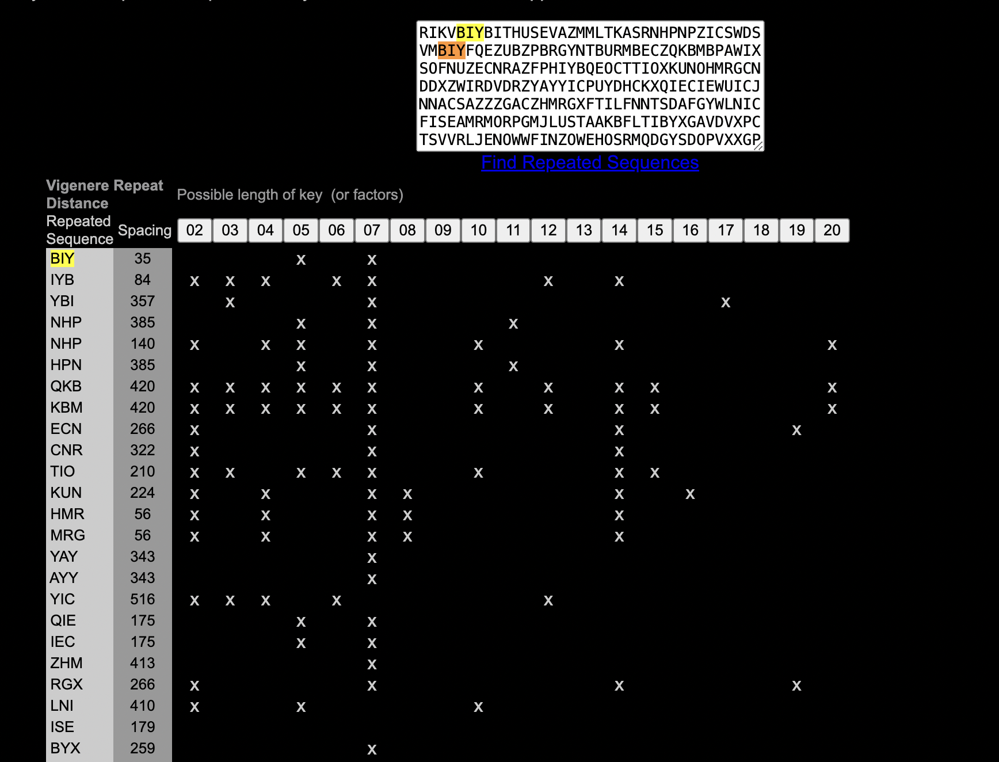
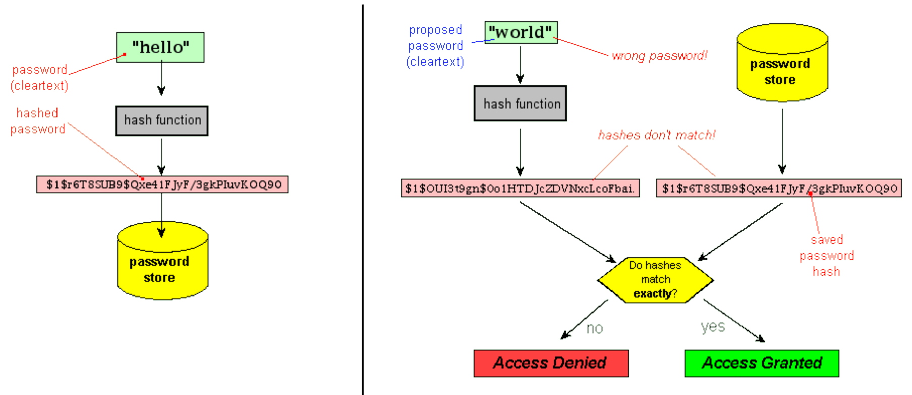

# Cifrado por transposición (permutation cipher)

Ejemplo de cifrado por permutación de columnas

**Mensaje original:** 'EJEMPLO DE CIFRADO POR PERMUTACION'

**Clave:** 3142 

## Proceso de cifrado

### Paso 1: Eliminar espacios y dividir el mensaje en columnas

```
E J E M
P L O D
E C I F
R A D O
P O R P
E R M U
T A C I
O N X X
```

*El padding se utiliza para completar la última fila si es necesario, asegurando que todas las columnas tengan la misma longitud.*

### Paso 2: Reordenar las columnas según la clave (3142)

```
E	E	M	J
O	P	D	L
I	E	F	C
D	R	O	A
R	P	P	O
M	E	U	R
C	T	I	A
x	O	x	N
```

La primera columna pasa a ser la segunda. La segunda columna pasa a ser la cuarta.
La tercera pasa a ser la primera. La cuarta, pasa a ser la tercera.

### Paso 3: Leer el mensaje cifrado

Mensaje cifrado final: `EEMJOPDLIEFCDROARPPOMEURCTIAxOxN`

## Proceso de descifrado

### Paso 1: Dividir el mensaje cifrado en columnas

```
E	E	M	J
O	P	D	L
I	E	F	C
D	R	O	A
R	P	P	O
M	E	U	R
C	T	I	A
x	O	x	N
```

### Paso 2: Reordenar las columnas según el orden original (3142)

```
E J E M
P L O D
E C I F
R A D O
P O R P
E R M U
T A C I
O N X X
```

### Paso 3: Leer el mensaje descifrado

Mensaje descifrado: `EJEMPLODECIFRADOPORPERMUTACION`

Mensaje original con espacios: `EJEMPLO DE CIFRADO POR PERMUTACION`

---
*Este método de cifrado es relativamente simple pero puede ser efectivo para mensajes cortos. Sin embargo, es vulnerable a análisis de frecuencia.*

--------

**Ejercicios**

**1. Cifrado por permutación (transposición, transposition)**

Implementa dos scripts en python que permitan aplicar cifrado y descifrado por permutación. Deben funcionar así (puedes ayudarte de un LLM, como GPT, Claude, LLama o Gemini):

__Cifrar__
```
$ python crypt.py "EJEMPLO DE CIFRADO POR PERMUTACION" 3142
EEMJOPDLIEFCDROARPPOMEURCTIAxOxN
```

__Descifrar__
```
$ python decrypt.py "EEMJOPDLIEFCDROARPPOMEURCTIAxOxN" 3142
EJEMPLODECIFRADOPORPERMUTACION
```

-------
**2. Sustitución monoalfabética. Cifrado César**

En un cifrado César, cada letra se sustituye por la letra situada 3 posiciones más adelante en el alfabeto (desplazamiento de 3 unidades):

```
ABCDEFGHIJKLMNOPQRSTUVWXYZ
DEFGHIJKLMNOPQRSTUVWXYZABC
```

Supongamos que queremos cifrar el siguiente mensaje: 

    Send lawyers, guns and money

El resultado sería:

`Vhqg odzbhuv, jxqv dqg prqhb`

2.1 Crea un script en Python que implemente el cifrado César. Debe funcionar así:

```
$ python cesar.py "Send lawyers, guns and money" 
Vhqg odzbhuv, jxqv dqg prqhb
```

Modifica el script para que admita dos argumentos opcionales: modo (encrypt, decrypt) y shift (un entero, que indica desplazamiento). Por defecto, en el cifrado César shift=3.

P. ej.:

```
$ python cesar.py "Send lawyers, guns and money" -m e -s 4
Wirh peacivw, kyrw erh qsric
```


(por defecto, shift=3)
```
$ python cesar.py "Vhqg odzbhuv, jxqv dqg prqhb" -m d
Send lawyers, guns and money
```

```
$ python cesar.py "Wirh peacivw, kyrw erh qsric" -m d -s 4   
Send lawyers, guns and money
```

Debería de poder informar sobre el uso, así:

```
$ python cesar.py                                            
Uso: cesar.py [-h] [-m {e,d}] [-s SHIFT] text
cesar.py: error: el parámetro text es obligatorio
```

2.2 En el siguiente trozo de código, alphabet representa el alfabeto (inglés), char el carácter que queremos cifrar y shift el desplazamiento (supongamos shift=3) . 
  2.2.1 Si char='y', ¿cuál será el valor de `index` y `new_index`? 
  2.2.2 ¿Cómo se llama el operador `%`?
  
```
index = alphabet.index(char.lower())
if mode == 'e':
    new_index = (index + shift) % 26
```

---
**3. Ataques de Fuerza bruta**
 
El cifrado César es vulnerable a un ataque de fuerza bruta. Para descifrar un criptograma cifrado con este algoritmo basta con probar todos los desplazamientos posibles hasta encontrar una frase con sentido.

Ejemplo:
```
$ python brute.py "Vhqg odzbhuv, jxqv dqg prqhb"

Desplazamiento 1: ugpf ncyagtu, iwpu cpf oqpga
Desplazamiento 2: tfoe mbxzfst, hvot boe npofz
Desplazamiento 3: send lawyers, guns and money <----
Desplazamiento 4: rdmc kzvxdqr, ftmr zmc lnmdx
Desplazamiento 5: qclb jyuwcpq, eslq ylb kmlcw
Desplazamiento 6: pbka ixtvbop, drkp xka jlkbv
Desplazamiento 7: oajz hwsuano, cqjo wjz ikjau
Desplazamiento 8: nziy gvrtzmn, bpin viy hjizt
Desplazamiento 9: myhx fuqsylm, aohm uhx gihys
Desplazamiento 10: lxgw etprxkl, zngl tgw fhgxr
Desplazamiento 11: kwfv dsoqwjk, ymfk sfv egfwq
Desplazamiento 12: jveu crnpvij, xlej reu dfevp
Desplazamiento 13: iudt bqmouhi, wkdi qdt ceduo
Desplazamiento 14: htcs aplntgh, vjch pcs bdctn
Desplazamiento 15: gsbr zokmsfg, uibg obr acbsm
Desplazamiento 16: fraq ynjlref, thaf naq zbarl
Desplazamiento 17: eqzp xmikqde, sgze mzp yazqk
Desplazamiento 18: dpyo wlhjpcd, rfyd lyo xzypj
Desplazamiento 19: coxn vkgiobc, qexc kxn wyxoi
Desplazamiento 20: bnwm ujfhnab, pdwb jwm vxwnh
Desplazamiento 21: amvl tiegmza, ocva ivl uwvmg
Desplazamiento 22: zluk shdflyz, nbuz huk tvulf
Desplazamiento 23: yktj rgcekxy, maty gtj sutke
Desplazamiento 24: xjsi qfbdjwx, lzsx fsi rtsjd
Desplazamiento 25: wirh peacivw, kyrw erh qsric
```

3.1 Implementa el script `brute.py`

3.2 Siguiendo la secuencia, ¿cuál sería el resultado de `Desplazamiento 26`?

3.3 ¿Cuál sería el resultado de **cifrar** con desplazamiento 13 **y volver a cifrar** el resultado anterior con desplazamiento 13? 

Es decir, ¿cuál es el resultado de esta secuencia?
```
$ python cesar.py "Envia abogados, armas y dinero" -m e -s 13
Raivn nobtnqbf, neznf l qvareb

$ python cesar.py "Raivn nobtnqbf, neznf l qvareb" -m e -s 13
```

3.4 El cifrado con desplazamiento 13 del ejercicio anterior tiene un nombre especial, ¿podrías investigar cuál es ese nombre?


**4. Sustitución monoalfabética. Cifrado con diccionario**

En lugar de cifrar una letra con la que le sigue x posiciones más adelante en el alfabeto, se utiliza un diccionario personalizado para realizar la sustitución de letras. En este tipo de cifrado, se reemplaza cada letra del texto original por una letra diferente, especificada en un diccionario preestablecido.

Por ejemplo, utilizando el diccionario proporcionado:

```
ABCDEFGHIJKLMNOPQRSTUVWXYZ
ZXCVBNMASDFGHJKLQWERTYUIOP
```

La frase: "EZ GAUDE GERRAREN ALDE"
se cifraría como: "BP MZTVB MBWWZWBJ ZGVB"

Al igual que en el cifrado César, es importante destacar que cada letra del mensaje en claro siempre es sustituida en el criptograma por la misma letra. En el ejemplo del diccionario, la E siempre se sustituye por la B, la Z por la P, etc. Este tipo de cifrado se conoce como cifrado de sustitución monoalfabética.

4.1 Implementa un script diccionario.py que permita cifrar y descifrar por sustitución basándose en un diccionario. Un ejemplo de ejecución sería:

```
$ python diccionario.py "EZ GAUDE GERRAREN ALDE" "ZXCVBNMASDFGHJKLQWERTYUIOP"
BP MZTVB MBWWZWBJ ZGVB
```

**5. Criptonálisis. Análisis de frecuencias.**

Una técnica sencilla de criptoanálisis para romper un cifrado de sustitución monoalfabética es el análisis de frecuencias. Se basa en el hecho de que, dado un texto, ciertas letras o combinaciones de letras aparecen más a menudo que otras, existiendo distintas frecuencias para ellas. Estas frecuencias dependen del idioma del texto en claro. 




*<small>Frecuencia de las letras en un texto inglés. Fuente: [Wikipedia](https://es.wikipedia.org/wiki/An%C3%A1lisis_de_frecuencias).</small>*

Por ejemplo, las letras que más se repiten en inglés son e,t,a,o,i,n...


Sabiendo que el siguiente criptograma pertenece a un cifrado por diccionario (sustitución monoalfabética) y que el idioma original es el inglés, aplica análisis de frecuencia para descrifrarlo:

```
BAR BS GUR SRNGHERF BS GUR PNRFNE PVCURE BE INEVNGVBAF BS VG GUNG ZNXRF VG RNFVYL PBZCEBZVFRQ VF GUNG RNPU PUNENPGRE AB ZNGGRE UBJ ZNAL CBFVGVBAF VG VF FUVSGRQ VF PBAFVFGRAGYL ERCERFRAGRQ OL GUR FNZR PBEERFCBAQVAT PUNENPGRE VS GUR PVCUREGRKG PUNENPGRE SBE N VF A GURA VG VF NYJNLF A GUEBHTUBHG GUR RAPELCGRQ ZRFFNTR GUVF ZRNAF GUNG PELCGNANYLFVF PNA HFR PUNENPGRE SERDHRAPL NANYLFVF GB ZNXR THRFFRF NG JUVPU PVCUREGRKG PUNENPGREF PBEERFCBAQ GB JUVPU CYNVAGRKG PUNENPGREF
```

Te será de gran utilidad esta aplicación web: [CrackMono](./crackmono/public/index.html)

5.1 ¿Cuál es el texto en claro?

5.2 En el criptograma encontramos los siguientes digramas (o bigramas): 'bs','be','ab'. ¿A qué palabras corresponden en el texto en claro? ¿Podría ayudarnos en el criptoanálisis un análisis de digramas?

5.3 Desde el punto de vista de la seguridad, ¿qué sencilla recomendación a la hora de cifrar (sin cambiar el algoritmo de cifrado) haría que el criptoanálisis fuera bastante más complejo?

5.4 ¿Cuántos años tardaríamos en aplicar fuerza bruta a un criptograma cifrado con un algoritmo de sustitución monoalfabética (donde cada letra se sustituye por otra según un diccionario aleatorio)? Asume que somos capaces de calcular 10^9 claves por segundo... es decir, mil millones de claves *por segundo*.

**6. Sustitución polialfabética. Cifrado Vigenère.**

El cifrado Vigenère es un método de cifrado por sustitución polialfabética que utiliza una clave para encriptar y desencriptar un mensaje. Es una mejora del cifrado César, ya que usa múltiples alfabetos desplazados en lugar de uno solo.

**Pasos para el cifrado Vigenère**

1. Seleccionar el mensaje y la clave:
   - Mensaje (texto claro): `ATAQUE AL AMANECER`
   - Clave: `LEMON`

2. Repetir la clave para que coincida con la longitud del mensaje:
   - El mensaje tiene 16 caracteres (sin contar espacios)
   - La clave "LEMON" se repite tantas veces como sea necesario para igualar la longitud del mensaje:
     ```
     LEMONLEMONLEMONL
     ```

3. **Convertir las letras a números:** (A = 0, B = 1, ..., Z = 25)
   - Mensaje: `ATAQUEALAMANECER`
     ```
     A  T  A  Q  U  E  A  L  A   M  A   N  E  C  E  R
     0  19 0 16 20  4  0 11  0  12  0  13  4  2  4  17
     ```

   - Clave: `LEMONLEMONLEMONL`
     ```
     L  E  M  O  N  L E  M  O  N  L E  M  O  N  L 
     11 4 12 14 13 11 4 12 14 13 11 4 12 14 13  11
     ```

4. **Suma los números del mensaje con los números de la clave (mod 26):**
   ```
      0  19  0  16  20  4   0  11   0  12   0  13   4   2  4  17
   + 11  4  12  14  13  11  4  12  14  13  11   4  12  14  13 11
   --------------------------------------------------------------
     11  23 12  30  33  15  4  23   14 25  11  17  16  16 17  28
   ```

5. **Tomar el módulo 26 de cada suma:**
   ```
     11 23 12  4 7 15 4 23 14 25 11 17 16 16 17 2 
   ```

6. **Convertir estos números de nuevo a letras:**
   ```
     L  X  M  E  H  P  E  X  O  Z  L  R  Q  Q  R  C
   ```

   LXMEHP EX OZLRQQRC

### Texto cifrado
El mensaje cifrado utilizando el cifrado Vigenère con la clave "LEMON" es:
**LXMEHPEXOZLRQQRC**

Fíjate que la letra A del mensaje en claro (**ATAQUEALAMANECER**) aparece en el criptograma sustituida por distintas letras, dependiendo de la posición (una L, una M, una E y una una O). Ante esta situación no es viable un ataque por análisis de frecuencias... ¿o sí lo es?

6.1 Desarrolla un script en python que implemente el cifrado Vigenère, con los siguiente parámetros (-m texto en plano, -k clave):

```
$ python vigenere.py -m "ATAQUE AL AMANECER" -k "LEMON"
LXMEXPEXOZLRQQRC
```

**7. El método Kasiski (ataque criptográfico al cifrado Vigenère)** 

El método Kasiski es un método de criptoanálisis (un ataque criptográfico) al cifrado de Vigenère (1586). Dicho método debe su nombre al oficial prusiano Friedrich Kasiski que lo publicó en 1863 (es decir, 277 años después).

 Kasiski se dió cuenta de un curioso efecto en algunos criptogramas Vigenère, como este:

```
$ python vigenere.py -m "ATAQUE AL AMANECER XXXXATAQUE" -k "LEMON"
LXMEHPEXOZLRQQRCBJLKLXMEHP
```
En el criptograma **LXMEHPE**XOZLRQQRCBJLK**LXMEHP**
hay palabras repetidas, lo cual significa casi con toda probabilidad que dichas palabras no sólo eran la misma antes del cifrado sino que además la clave coincide en la misma posición en ambas ocurrencias.

Sabiendo entonces que la distancia entre palabras repetidas (20 caracteres en el ejemplo) es múltiplo de la longitud de la clave (LEMON=5 caracteres en el ejemplo), era cuestión de buscar diferentes palabras que se repitieran y hallar su máximo común divisor, para de esta manera encontrar un múltiplo cercano a la longitud de la clave. La longitud de la clave será este número o algún factor primo del mismo.


Veamos un ejemplo. En la imagen tenemos un criptograma cifrado con Vigenère:



Vemos una secuencia repetida de tres letras (BIY) (se ha seleccionado en el criptograma esa secuencia entre la primera BIY y la segunda BIY). La distancia es de 35 caracteres. Los factores primos son 5 y 7 (5x7=35). Podemos repetir el proceso con todas las repeticiones y vemos que la longitud de la clave que haría posible esas repeticiones muy probablemente sea 7 (la columna con más X)

Si tomamos ahora las letras del criptograma de 7 en 7 (0, 7, 14, 21, 28, ...) sabemos que están cifradas con el mismo desplazamiento y por tanto es posible un ataque por análisis de frecuencia en esa secuencia de caracteres. Ídem si tomamos las letras de 7 en 7 pero empezando en la posición 1, 8, 15, 22, ... 

La siguiente herramienta (Vigenère Cracking Tool) permite aplicar el método Kasiski de forma sencilla:

https://www.simonsingh.net/The_Black_Chamber/vigenere_cracking_tool.html

7.1 Usando la herramienta anterior, aplica el método Kasiski para romper el cifrado de este criptograma:

RIKVBIYBITHUSEVAZMMLTKASRNHPNPZICSWDSVMBIYFQEZUBZPBRGYNTBURMBECZQKBMBPAWIXSOFNUZECNRAZFPHIYBQEOCTTIOXKUNOHMRGCNDDXZWIRDVDRZYAYYICPUYDHCKXQIECIEWUICJNNACSAZZZGACZHMRGXFTILFNNTSDAFGYWLNICFISEAMRMORPGMJLUSTAAKBFLTIBYXGAVDVXPCTSVVRLJENOWWFINZOWEHOSRMQDGYSDOPVXXGPJNRVILZNAREDUYBTVLIDLMSXKYEYVAKAYBPVTDHMTMGITDZRTIOVWQIECEYBNEDPZWKUNDOZRBAHEGQBXURFGMUECNPAIIYURLRIPTFOYBISEOEDZINAISPBTZMNECRIJUFUCMMUUSANMMVICNRHQJMNHPNCEPUSQDMIVYTSZTRGXSPZUVWNORGQJMYNLILUKCPHDBYLNELPHVKYAYYBYXLERMMPBMHHCQKBMHDKMTDMSSJEVWOPNGCJMYRPYQELCDPOPVPBIEZALKZWTOPRYFARATPBHGLWWMXNHPHXVKBAANAVMNLPHMEMMSZHMTXHTFMQVLILOVVULNIWGVFUCGRZZKAUNADVYXUDDJVKAYUYOWLVBEOZFGTHHSPJNKAYICWITDARZPVU

**8. Algoritmo DES. Cifrado de clave simétrica DES**

DES es un algoritmo de cifrado simétrico por bloques desarrollado en la década de 1970 por IBM y adoptado como estándar por el gobierno de EE.UU. en 1977. Sus características principales son:

- Tamaño de bloque: Opera sobre bloques de 64 bits.
- Tamaño de clave: Utiliza una clave de 56 bits (aunque se representa como 64 bits, 8 son de paridad).
- El algoritmo combina varias técnicas: desplazamientos, sustituciones y operaciones XOR, entre otras, para obtener bloques cifrados de 64 bits.

Siguiendo la descripción detallada del [algoritmo DES](https://web.archive.org/web/20240616180003/https://page.math.tu-berlin.de/~kant/teaching/hess/krypto-ws2006/des.htm), completa los siguientes ejercicios, mediante scripts Python:

**Ejercicios opcionales**

8.1 Lee el funcionamiento del algoritmo DES:
http://page.math.tu-berlin.de/~kant/teaching/hess/krypto-ws2006/des.htm

Mensaje en claro (en hexadecimal):
```
M=DECAFDECAFDECAF0
(1101111011001010111111011110110010101111110111101100101011110000)
```

si la clave es:

```
K=133457799BBCDFF1
(0001001100110100010101110111100110011011101111001101111111110001)
````

¿cuál es el valor de R1? (la respuesta debe ser un número binario de 32 bits)

8.2 De igual forma, sea : 
```
M=DEADBEEFDEADBEEF
(1101111010101101101111101110111111011110101011011011111011101111)
```

```
K=133457799BBCDFF1
(0001001100110100010101110111100110011011101111001101111111110001)
```

¿cuál sería el valor de R1?

8.3 Finalmente, manteniendo las condiciones anteriores, supongamos que ahora el mensaje es "BITCOINS", ¿cuál es ahora R1?


Referencias DES
======

https://en.wikipedia.org/wiki/Block_cipher#/media/File:SubstitutionPermutationNetwork2.png

https://en.wikipedia.org/wiki/Data_Encryption_Standard

https://en.wikipedia.org/wiki/DES_Challenges

https://en.wikipedia.org/wiki/DESCHALL_Project

https://en.wikipedia.org/wiki/EFF_DES_cracker


**9. Cifrado AES. Advanced Encryption Standard**

El Estándar de Cifrado Avanzado (AES, por sus siglas en inglés) es un algoritmo de cifrado simétrico ampliamente utilizado y considerado muy seguro. Características principales:

1. Estructura:
   - Es un cifrado por bloques.
   - Tamaño de bloque fijo de 128 bits (16 bytes).
   - Soporta claves de 128, 192 o 256 bits.

2. Rondas:
   - Utiliza múltiples rondas de transformación.
   - El número de rondas depende del tamaño de la clave:
     * 10 rondas para claves de 128 bits
     * 12 rondas para claves de 192 bits
     * 14 rondas para claves de 256 bits
3. Seguridad:
   - Resistente a ataques conocidos de criptoanálisis
   - __*No se conocen ataques prácticos que comprometan su seguridad.*__

4. Eficiencia:
   - Diseñado para ser eficiente en hardware y software.
   - Permite implementaciones rápidas y compactas.

5. Adopción:

   - __Estándar global para cifrado simétrico__
   - Utilizado en protocolos como TLS, IPsec, SSH, etc.

**Ejercicios**

9.1 Explica qué son los modos ECB, CBC en un cifrado por bloques.

9.2 Supongamos que tienes un sistema que utiliza AES-128 en modo ECB (Electronic Codebook) para cifrar mensajes y la siguiente información:

   Clave de cifrado (en hexadecimal):
   2b7e151628aed2a6abf7158809cf4f3c

   Mensaje a cifrar (en texto plano):
   "Hola Mundo AES!"

a) Convierte el mensaje de texto plano a su representación hexadecimal.

b) Dado que AES opera en bloques de 16 bytes (128 bits), ¿cuántos bloques se necesitarán para cifrar este mensaje? ¿Se necesitará relleno (padding)?

c) Si se necesita relleno, aplica PKCS7 (explica en qué consiste) e indica cómo se vería el mensaje con el relleno aplicado (en hexadecimal)


Funciones Hash
=============

Resumen criptográfico
(Hash)

* Funciones hash
  h(x) = y 

* Función matemática irreversible
* Debe evitar colisiones
* Debe estar definida para cualquier x


* Si h(x) = y  entonces:
 - NO debe ser posible derivar x a partir de y (es decir, no debe existir la función inversa de h)
 - Idealmente, NO debería existir ningún otro x' tal que x' != x y h(x') = y  (es decir, debe evitar colisiones) 

```
$ echo Kaixo |md5sum
ddf3970193c3c626b4cc7d557f595e7b  
```
(hash md5 = 32 símbolos hexa => 32/2 caracteres => 16 bytes ==> 16*8 = 128 bits)

```
$ echo Kaixo. |md5sum
79b770191c18b8ce35216a396d385a85
```
```
$ echo Kaixo  > file.txt

$ md5sum file.txt
ddf3970193c3c626b4cc7d557f595e7b

$ echo Kaixo > fichero.txt

$ md5sum fichero.txt 
ddf3970193c3c626b4cc7d557f595e7b

$ echo -n kaixo | md5sum 
017c2cdcef481181a26cdb88ca081994
```

(comprobar online https://www.md5.cz/ )


### MD5 
* Desarrollado en 1991 por Ronald Rivest (MIT) 
* message-digest algorithm v5
* considerado inseguro por problemas de colisión

Ver ejemplo: https://www.mscs.dal.ca/~selinger/md5collision/

### SHA 
- Secure Hash Algorithm
   - SHA-1
   - SHA-256
   - SHA-512

```
$ shasum --help
Usage: shasum [OPTION]... [FILE]...
Print or check SHA checksums.

  -a, --algorithm   1 (default), 224, 256, 384, 512, 512224, 512256
```

```
echo -n hola | shasum 
99800b85d3383e3a2fb45eb7d0066a4879a9dad0  
```
(40 símbolos hexa --> 40/2 = 20 caracteres => 20 bytes * 8 bits/byte = 160bits)

```
echo -n hola | shasum -a 224
8cf31238b4a396f90185f770921dc63b31f4d48604026ffd4f8ddc80  (56 símbolos -> 28 caracteres => 28*8 = 224 bits) 
```
**Usos**

* Comprobación de integridad de ficheros
Ejemplo: http://releases.mozilla.org/pub/firefox/releases/130.0/

* Almacenamiento de hashes en lugar de passwords en claro


(Fuente: http://www.unixwiz.net/techtips/iguide-crypto-hashes.html)
* Implementación de Firma digital 

**Ejercicios**

10. Hemos encontrado el siguiente contenido dentro del fichero /etc/shadow de una antigua máquina Linux:

```
test:$6$v/Z3Vau7$ziIipwuJ0C0MA7mSq8y.9dKuCpOlmA2DgHbUs.okDChmkSbIwf4krzKnidSn91uJo98wBU2bozCgel25AVe39.:15009:0:99999:7
````

- Explica qué es cada campo. 
- ¿Qué algoritmo de hash se ha aplicado?
- ¿En qué fecha se cambió la contraseña de este usuario por últma vez?

11. Hemos encontrado el siguiente contenido dentro del fichero /etc/shadow de una máquina Linux reciente:

```
juanan:$y$j9T$6lAXXnVYLr2Uwmhv9JpLL/$0S7MZaAbYpz/oQrHta9Q71rEOPTtfH9yliTW5yH.Hv3:19995:0:99999:7:::
```

- Explica qué es cada campo. 
- ¿Qué algoritmo de hash se ha aplicado?
- ¿En qué fecha se cambió la contraseña de este usuario por últma vez?


<!-- 
# Ideas para trabajo opcional

###  Cifrado ADFGVX
 - Descripción
 - Scripts que permitan el cifrado y descifrado
 - Herramienta web que ayude en el criptoanálisis 
 - [Más info](https://www.researchgate.net/publication/306265347_Deciphering_ADFGVX_messages_from_the_Eastern_Front_of_World_War_I)

-->