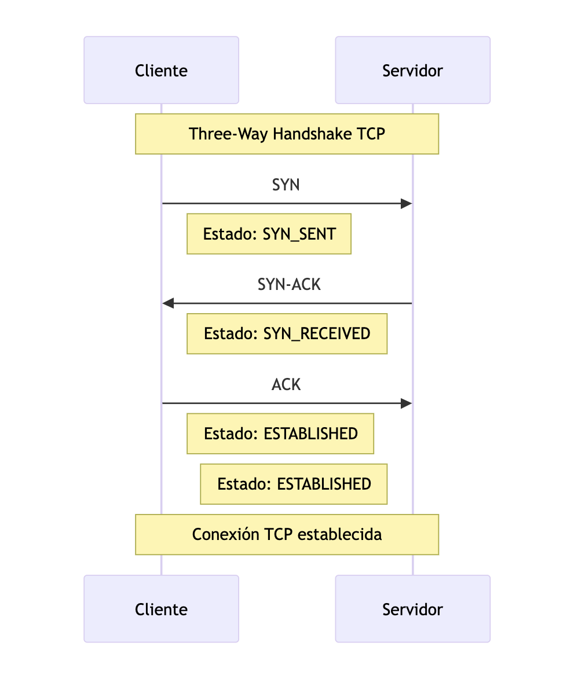
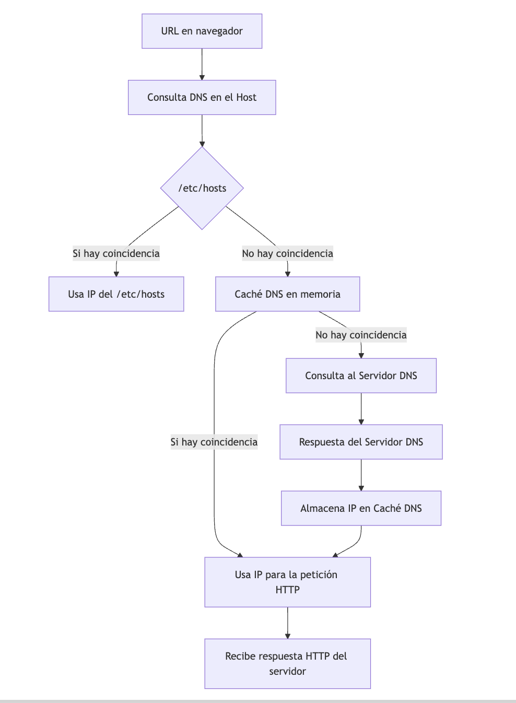
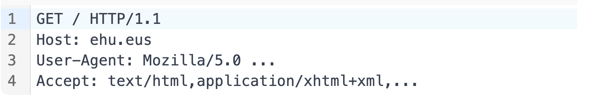
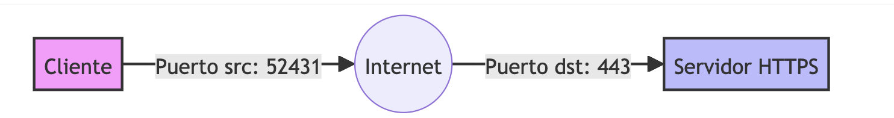
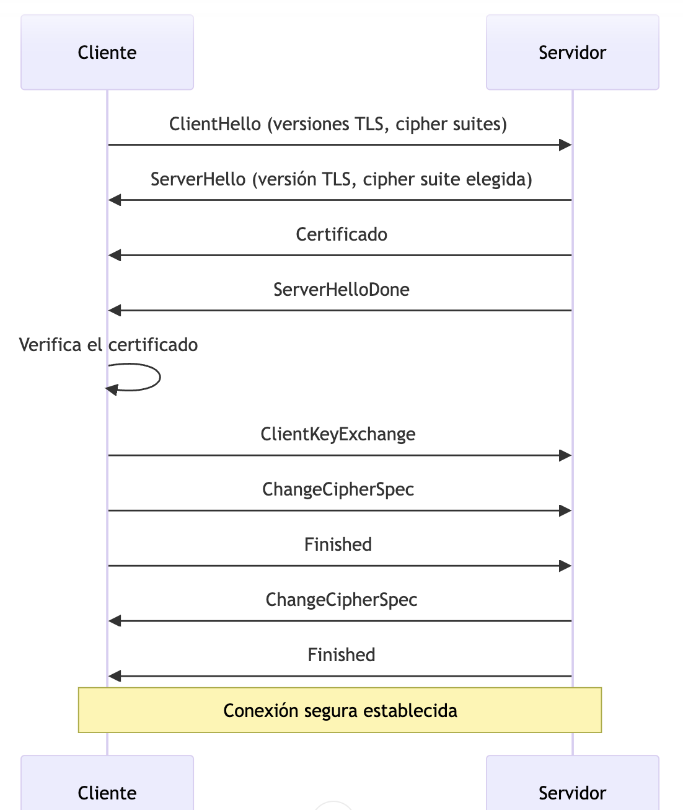

# Introducción

¿Cuál es el proceso a nivel de red que sigue una petición HTTP desde que el usuario teclea la URL a visitar https://ehu.eus hasta que el servidor emite su respuesta? (conceptos clave: protocolo, nombre de dominio, DNS, /etc/hosts, caché DNS, dirección IP, ARP, puertos tcp, sockets, http, GET, POST, código de respuesta HTTP)


El proceso que sigue una petición HTTP desde que el usuario teclea `https://ehu.eus` hasta que el servidor responde es complejo, pero podemos desglosarlo en pasos clave:

1. **Resolución de nombres de dominio:** El navegador web recibe la URL `https://ehu.eus`.  Primero, necesita traducir el nombre de dominio (`ehu.eus`) a una dirección IP numérica que las computadoras entienden.  Esto se realiza mediante el **Sistema de Nombres de Dominio (DNS)**.  El navegador consulta recursivamente servidores DNS, empezando por los servidores DNS configurados en el sistema operativo (usualmente proporcionados por el proveedor de internet), hasta llegar a un servidor DNS autoritativo que conoce la dirección IP de `ehu.eus`.  Este proceso implica varias consultas y respuestas UDP.

2. **Establecimiento de la conexión TCP:** Una vez obtenida la dirección IP (por ejemplo, 192.0.2.1, que es una IP de ejemplo, no la real de ehu.eus), el navegador inicia una conexión TCP con el servidor web en esa dirección IP.  Esto implica:
    * **Establecimiento de un socket:** El navegador crea un socket en su lado (cliente) y el servidor crea un socket en su lado (servidor).  Un socket es un punto final de comunicación.
    * **Tres vías de saludo (Three-way handshake):**  El navegador y el servidor intercambian paquetes TCP para establecer una conexión confiable, ordenada y libre de errores.  Se negocian parámetros como el número de secuencia y la ventana de congestión.  Se utilizan los **puertos TCP**.  El navegador normalmente usa un puerto efímero (alto) y el servidor escucha en el puerto 443 (para HTTPS).

3. **Encriptación SSL/TLS (para HTTPS):**  Como la URL comienza con `https`, se utiliza el protocolo SSL/TLS para encriptar la comunicación entre el navegador y el servidor.  Esto implica un *handshake* SSL/TLS adicional, donde se negocian algoritmos de encriptación y se establecen claves de sesión.

4. **Envío de la petición HTTP:** Una vez establecida la conexión segura, el navegador envía la petición HTTP al servidor.  Esta petición generalmente incluye:
    * **Método HTTP:**  En la mayoría de los casos, será un método `GET` si el usuario solo está solicitando una página web.  Si se está enviando información al servidor (por ejemplo, un formulario), se utilizaría el método `POST`.
    * **URL:** La ruta específica dentro del servidor web (ej: `/index.html`).
    * **Cabeceras HTTP:** Información adicional como el tipo de navegador, el lenguaje preferido, etc.

5. **Procesamiento en el servidor:** El servidor web (ej. Apache, Nginx) recibe la petición HTTP, la procesa y genera una respuesta.

6. **Envío de la respuesta HTTP:** El servidor envía una respuesta HTTP al navegador.  Esta respuesta incluye:
    * **Código de estado HTTP:** Un código numérico que indica el resultado de la petición (ej: `200 OK` si la petición fue exitosa, `404 Not Found` si la página no existe, `500 Internal Server Error` si hay un error en el servidor).
    * **Cabeceras HTTP:** Información adicional como el tipo de contenido, la longitud del contenido, etc.
    * **Cuerpo de la respuesta:** El contenido real de la página web (HTML, imágenes, etc.).

7. **Cierre de la conexión TCP:** Después de recibir la respuesta, el navegador cierra la conexión TCP.

## Detalle del Three Way Handshake



## Detalle resolución nombres de dominio



## Detalle de la petición HTTP



```
GET / HTTP/1.1
Host: ehu.eus
User-Agent: Mozilla/5.0 ...
Accept: text/html,application/xhtml+xml,...
```

## Detalle de la respuesta HTTP

```
HTTP/1.1 200 OK
Date: Mon, 01 Jan 2023 12:34:56 GMT
Server: Apache/2.4.6 (CentOS)
Content-Length: 1234
Content-Type: text/html; charset=UTF-8

<!DOCTYPE html>
<html>
...
```

## Detalle de los sockets (IPs + puertos TCP)



## Detalle del handshake SSL/TLS



Explicación de los pasos:

1. **ClientHello**: El cliente inicia el handshake enviando un mensaje con las versiones de TLS que soporta y las suites de cifrado que puede usar.

2. **ServerHello**: El servidor responde seleccionando la versión de TLS y la suite de cifrado que se usará.

3. **Certificado**: El servidor envía su certificado digital, que incluye su clave pública.

4. **ServerHelloDone**: El servidor indica que ha terminado esta fase del handshake.

5. **Verificación del certificado**: El cliente verifica la validez del certificado del servidor.

6. **ClientKeyExchange**: El cliente genera una clave pre-maestra y la encripta con la clave pública del servidor.

7. **ChangeCipherSpec**: El cliente indica que cambiará a la conexión cifrada.

8. **Finished (Cliente)**: El cliente envía un mensaje cifrado para verificar que el handshake se completó correctamente.

9. **ChangeCipherSpec**: El servidor también cambia a la conexión cifrada.

10. **Finished (Servidor)**: El servidor envía un mensaje cifrado para confirmar que el handshake se completó correctamente.

11. **Conexión segura establecida**: Ambas partes ahora tienen una conexión cifrada y autenticada.

Este diagrama simplifica el proceso, omitiendo algunos detalles técnicos, pero muestra los pasos principales del handshake SSL/TLS.