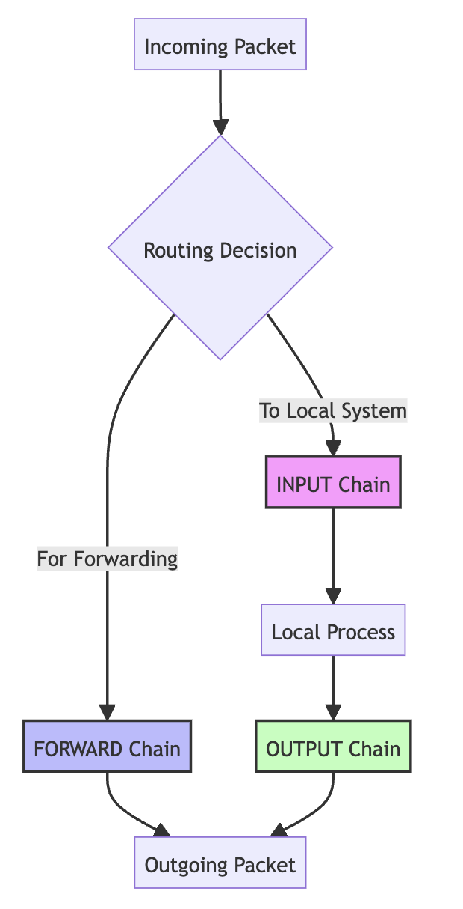
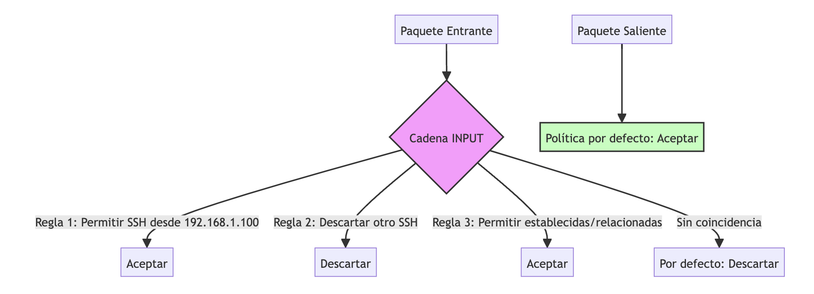
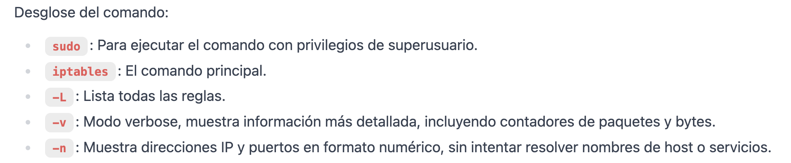

# Introducción a iptables


## Flujo básico




# Ejemplo: Filtrado de tráfico SSH





Reglas de iptables que implementan este ejemplo:

```bash
# Establecer políticas por defecto
iptables -P INPUT DROP
iptables -P OUTPUT ACCEPT

# Reglas para la cadena INPUT
iptables -A INPUT -p tcp --dport 22 -s 192.168.1.100 -j ACCEPT
iptables -A INPUT -p tcp --dport 22 -j DROP
iptables -A INPUT -m conntrack --ctstate ESTABLISHED,RELATED -j ACCEPT
```


```bash
# Ver reglas de iptables
sudo iptables -L -v -n
```



<!-- .slide: style="text-align: left;"> -->  
$ sudo iptables -L -v -n
```iptables 
Chain INPUT (policy DROP 0 packets, 0 bytes)
 pkts bytes target     prot opt in     out     source               destination         
    0     0 ACCEPT     tcp  --  *      *       192.168.1.100        0.0.0.0/0            tcp dpt:22
    0     0 DROP       tcp  --  *      *       0.0.0.0/0            0.0.0.0/0            tcp dpt:22
    0     0 ACCEPT     all  --  *      *       0.0.0.0/0            0.0.0.0/0            ctstate RELATED,ESTABLISHED
```