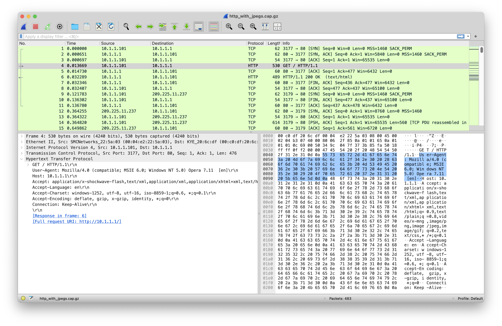

# Herramientas de seguridad de red

## WireShark


Ejemplos de [capturas](https://wiki.wireshark.org/samplecaptures#hypertext-transport-protocol-http) de paquetes con Wireshark.


## nmap

Escaneo de puertos y detección de servicios con __nmap__.

```bash
$ nmap -Pn sgssi.ikasten.io
Starting Nmap 7.95 ( https://nmap.org ) at 2024-10-20 21:47 CEST
Stats: 0:00:26 elapsed; 0 hosts completed (1 up), 1 undergoing Connect Scan
Connect Scan Timing: About 38.80% done; ETC: 21:48 (0:00:41 remaining)
Nmap scan report for sgssi.ikasten.io (40.118.98.125)
Host is up (0.047s latency).
Not shown: 996 filtered tcp ports (no-response)

PORT    STATE SERVICE
22/tcp  open  ssh
53/tcp  open  domain
80/tcp  open  http
443/tcp open  https

Nmap done: 1 IP address (1 host up) scanned in 52.51 seconds
```

```bash
$ nmap -sV -Pn sgssi.ikasten.io
Service scan Timing: About 100.00% done; ETC: 19:47 (0:00:00 remaining)
Nmap scan report for sgssi.ikasten.io (40.118.98.125)
Host is up (0.0061s latency).
Not shown: 996 filtered tcp ports (no-response)

PORT    STATE SERVICE  VERSION
22/tcp  open  ssh      OpenSSH 8.9p1 Ubuntu 3ubuntu0.10 (Ubuntu Linux; protocol 2.0)
53/tcp  open  domain?
80/tcp  open  http     nginx/1.18.0 (Ubuntu)
443/tcp open  ssl/http nginx 1.18.0 (Ubuntu)
1 service unrecognized despite returning data.
````

```bash
 $ nmap -sV -sC -Pn -vvv -p 22,80,443 sgssi.ikasten.io
 ...
 
 PORT    STATE SERVICE  REASON  VERSION
22/tcp  open  ssh      syn-ack OpenSSH 8.9p1 Ubuntu 3ubuntu0.10 (Ubuntu Linux; protocol 2.0)
| ssh-hostkey:
|   256 bd:1a:c4:96:09:e9:fa:b9:0e:82:2f:62:99:5c:e1:5f (ECDSA)
| ecdsa-sha2-nistp256 AAAAE2VjZHNhLXNoYTItbmlzdHAyNTYAAAAIbmlzdHAyNTYAAABBBBS2c9whrHE0LhbqWkWl1ouVQ4v2OK/zdMKw3I5oTQAaBJfbII89nBXuNCZho++KgzkNr522q8CUPGoOi3z/uko=
|   256 42:82:c1:02:d4:58:06:db:0b:b6:f2:3d:f6:74:2c:11 (ED25519)
|_ssh-ed25519 AAAAC3NzaC1lZDI1NTE5AAAAIMIWWuFBooYTRDdjv7H4NO75ub0/9tCiCVqUN/fMOCvO
80/tcp  open  http     syn-ack nginx 1.18.0 (Ubuntu)
|_http-server-header: nginx/1.18.0 (Ubuntu)
|_http-title: Did not follow redirect to https://sgssi.ikasten.io/
| http-methods:
|_  Supported Methods: GET HEAD POST OPTIONS
443/tcp open  ssl/http syn-ack nginx 1.18.0 (Ubuntu)
|_http-trane-info: Problem with XML parsing of /evox/about
|_http-server-header: nginx/1.18.0 (Ubuntu)
| http-methods:
|_  Supported Methods: GET HEAD POST OPTIONS
| http-title: Login
|_Requested resource was /login
|_ssl-date: TLS randomness does not represent time
| ssl-cert: Subject: commonName=sgssi.ikasten.io
| Subject Alternative Name: DNS:sgssi.ikasten.io
| Issuer: commonName=R11/organizationName=Let's Encrypt/countryName=US
| Public Key type: rsa
| Public Key bits: 2048
| Signature Algorithm: sha256WithRSAEncryption
| Not valid before: 2024-09-15T17:16:31
| Not valid after:  2024-12-14T17:16:30
| MD5:   153c:a28d:9f47:361b:7c3d:a62b:d44e:1874
| SHA-1: 9d95:cd14:45f8:8f90:c07a:d4b1:62ff:bcf0:6e37:bbdf
| -----BEGIN CERTIFICATE-----
| MIIE8DCCA9igAwIBAgISA7/9DjNdZ0DVjVf2IV9Jz3omMA0GCSqGSIb3DQEBCwUA
| MDMxCzAJBgNVBAYTAlVTMRYwFAYDVQQKEw1MZXQncyBFbmNyeXB0MQwwCgYDVQQD
| EwNSMTEwHhcNMjQwOTE1MTcxNjMxWhcNMjQxMjE0MTcxNjMwWjAbMRkwFwYDVQQD
| ExBzZ3NzaS5pa2FzdGVuLmlvMIIBIjANBgkqhkiG9w0BAQEFAAOCAQ8AMIIBCgKC
| AQEAmlmQu4zWjIKviuBalaxeQnmk6mLKpTdD6i6Htw+JSuaNa5Lsb+0tHN750oVu
| A2ZtRKsrIHvg4zNQUlMCp6Q16YCc1bUBN2JUyOY6p7YtZ2DadbTtDTLc6OmmWfW6
...
````

