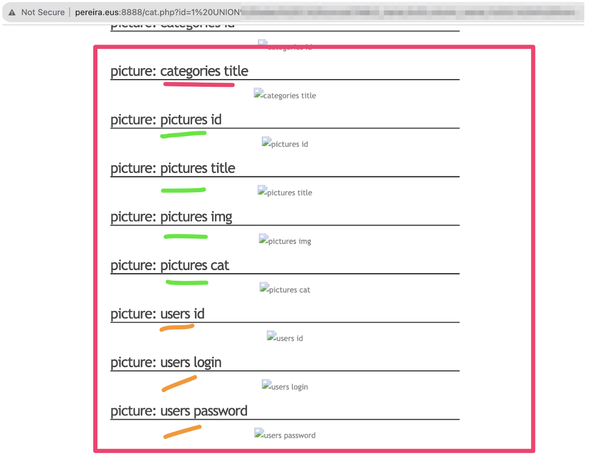
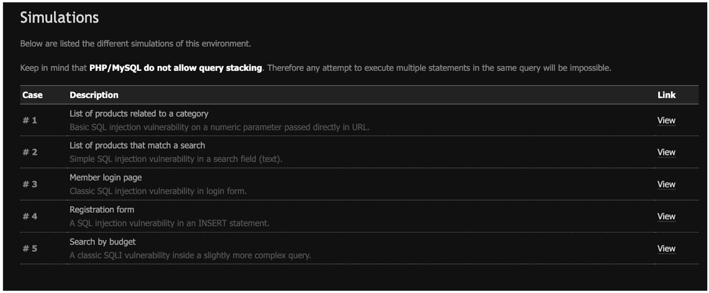
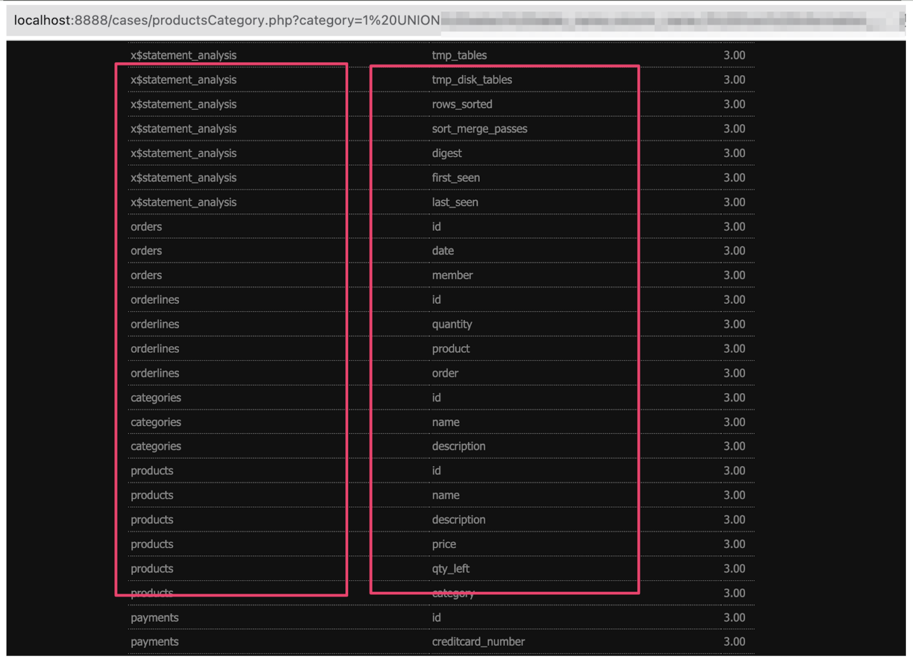

# Seguridad en aplicaciones web

Las aplicaciones web son uno de los principales objetivos de los ciberdelincuentes. La razón es que, al ser accesibles desde cualquier lugar, son un punto de entrada fácil para atacantes. Además, la mayoría de las aplicaciones web almacenan información sensible, como datos de usuarios, contraseñas, etc.

En este módulo aprenderemos a identificar y explotar vulnerabilidades comunes en aplicaciones web. Para ello, utilizaremos herramientas como __sqlmap__ y __Burp Suite__.

## 1. Introducción a sqli

La inyección de SQL es una vulnerabilidad común en aplicaciones web que permite a un atacante ejecutar comandos SQL arbitrarios en la base de datos subyacente. Esto puede llevar a la divulgación de información confidencial, la modificación de datos o incluso la eliminación de la base de datos completa.

1. Introducción a SQLi [(i)](https://docs.google.com/presentation/d/1AfVt7QhVSpog1NQ6t-a4eIBTPFP6aqly3uQXjSrwjmk/edit?usp=sharing) 

2. Introducción a SQLi [(ii)](https://docs.google.com/presentation/d/1Wc5U8rN1uK2zN-TigcXjfIayYSSEDPEIloMQngdl2tY/edit?usp=sharing)

3. Introducción a SQLi [(iii)](https://docs.google.com/presentation/d/1EP06LEFwZrtOic4H7vEvfo3hQyg7Jds9Mv1M_YX1sUU/edit?usp=sharing)

## 2. Actividades

__Actividad 1__ (SQLi Básico) Atendiendo a las explicaciones vistas en clase:
- indica cuáles son las entradas vulnerables a inyección SQL (A1.1)
- indica cómo es posible su explotación (A1.2)
- Identifica las causas de dicha vulnerabilidad (A1.3)
- Implementa el código necesario para protegerse (A1.4) 

[https://ikasten.io/basic_sqli/form.html](https://ikasten.io/basic_sqli/form.html)

[https://ikasten.io/basic_sqli/form2.html](https://ikasten.io/basic_sqli/form.html)

Código fuente utilizado: [https://github.com/juananpe/basic_sqli](https://github.com/juananpe/basic_sqli)

__Actividad 2__(SQLi Medio) Sigue las mismas pautas que en la actividad 1.
Debes instalar tu copia local: [https://github.com/juananpe/segurtasuna](https://github.com/juananpe/segurtasuna)

- Indica cuáles son las entradas vulnerables a inyección SQL (A2.1)
- Cómo es posible su explotación (A2.2)
- Identifica las causas de dicha vulnerabilidad (A2.3)
- Implementa el código necesario para protegerse (A2.4) 

¿Cuál sería la inyección SQL para conseguir este resultado?
 (nombre_tabla nombre_columna)?

Aparte de las explicaciones vistas en clase, tienes a tu disposición un PDF donde se explica todo en detalle:
https://pentesterlab.com/exercises/from_sqli_to_shell/course

Ten en cuenta que:
- el docker de este ejercicio (Photoblog) usa una versión muy vieja de mysql y php (Asume que no es posible usar el módulo mysqli de PHP)
- El código problemático está en la función 
 `function all($cat=NULL,$order =NULL)`
del fichero `www/classes/picture.php`

__Actividad 3__  (SQLi Ejercicios Extra) 

https://github.com/juananpe/sqlinjection 

De las 5 simulaciones:
- Las simulaciones 1 y 2 son de dificultad baja
- La simulación 3 tiene dificultad baja para la primera parte (identificarse como un usuario)
- Las simulaciones 4 y 5 tienen dificultad media/alta

Indica cuáles son las entradas usadas para la inyección SQL (A3.1)  en aquellas simulaciones en las que lo hayas conseguido.

El objetivo de cada simulación está marcado en la propia página (apartado "Goal")

Pista: en la primera simulación, mediante una inyección correcta es posible obtener los nombres de las bases de datos que alberga el sistema y para cada base de datos, los nombres de sus tablas.

También puedes obtener el nombre de las tablas y para cada tabla sus columnas:

