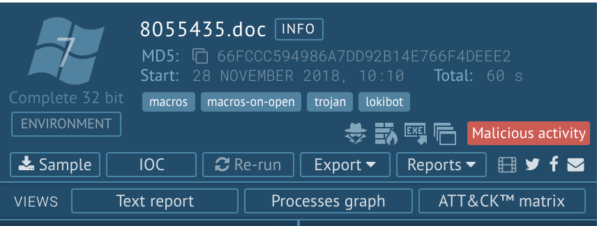
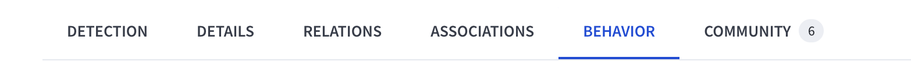

__Laboratorio Malware (2-4/12/2024)__

0) Crea una cuenta de usuario (gratuita) en app.any.run

1) Analiza el siguiente informe sobre una muestra de malware:
 https://app.any.run/tasks/f8266b12-3981-4aa8-a582-e897d903d6d1 

Se refiere a un fichero .doc con malware de macros. AnyRun ha abierto la muestra en un sistema Windows 7 con MS Office 2000. En la parte derecha de la pantalla podemos ver lo siguiente:

a) Pulsa en la etiqueta lokibot y explica qué tipo de malware es y cuál es su payload (efecto malicioso sobre el sistema infectado)

b) Descarga el sample (la muestra), descomprime el fichero (password:“infected”) y súbelo a [VirusTotal](https://virustotal.com). ¿Cuál es la etiqueta malware que más veces se ha asignado a esa muestra por los distintos antivirus?

c) La muestra analizada, al abrirla en Word, ejecuta código que intenta abrir distintas conexiones HTTP:
- c.1 ¿Contra qué dirección IP?
- c.2 ¿Ha conseguido obtener respuesta en las peticiones HTTP?
- c.3 ¿Ha usado método POST o GET?
- c.4 Concretamente, ¿a qué URL se ha intentado conectar? (http://xxxxxx/xxxxx/xxxxx)
- c.5 ¿Por qué crees que ha posido lanzar peticiones HTTP?

2) En esta URL puedes ver el ranking de muestras malware más populares durante la última semana: https://any.run/malware-trends/ 

Por ejemplo, en la primera posición se encuentra el malware #Lumma. 

https://any.run/malware-trends/lumma

- a. ¿Qué significa que Lumma Stealer opere como Malware-as-a-Service (MaaS)?
- b. ¿Cuáles son las capacidades principales de Lumma Stealer en términos de exfiltración de datos?
- c.  ¿Qué es y para qué usa Lumma un servidor C2? ¿A qué servidor C2 se intenta conectar?
- d. ¿Qué es un IOC? Identifica 3 IOC válidos para Lumma (uno de tipo IP, otro de tipo Domain y otro de tipo URL)

Descarga una muestra de Lumma:
https://app.any.run/tasks/20a99057-6518-4354-90fe-3857d0a583c8

Es recomendable que trabajes con el zip desde una máquina Linux (si no tienes un Linux a mano, abre una terminal en GitHub Codespaces)

Descomprime la muestra (pass: infected)
(puedes usar cualquier descompresor. En Linux, se recomienda 7z)

   $  7z x Contract\ Agreement\ for\ YouTube\ Partners.exe.zip

e) Sube el .exe.bin a VirusTotal. Desde la ficha de Behavior, identifica alguno de los IOC de la pregunta 2.d) (saca pantallazos)

3) Analiza el informe de stealc

https://any.run/malware-trends/stealc

- a. ¿Qué tipo de malware es?
- b. Se habla de una etapa de dropping, ¿a qué se refiere este término?
- c. En la etapa de dropping, se cita Laplas Clipper. ¿Para qué usa Stealc a Laplas Clipper?
- d. Nombra 3 formas de distribución del malware stealc
- e. Descarga una muestra (sample) de stealc. ¿En qué lenguaje se programó? ¿qué versión de GCC se usó para compilar el binario de la muestra?

4) Según este informe,  https://www.us-cert.gov/ncas/alerts/TA18-201A
el malware Emotet escribe en las siguientes ramas del registro de Windows:

HKEY_LOCAL_MACHINE\Software\Microsoft\Windows\CurrentVersion\Run

HKEY_CURRENT_USER\Software\Microsoft\Windows\CurrentVersion\Run

c-1.1. ¿Qué es el registro de Windows?
c.1.2 ¿Por qué Emotet escribe en esas ramas?
