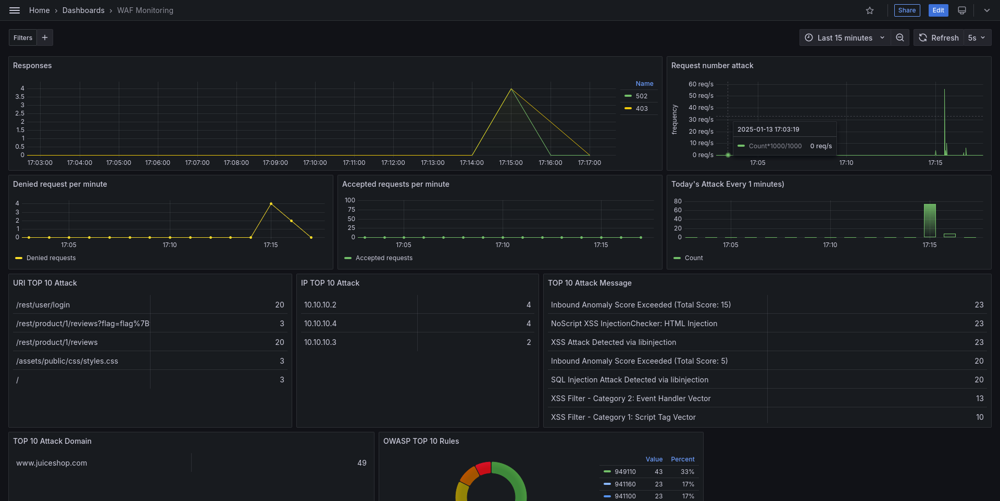

### Introducción

Los **Web Application Firewalls (WAF)** han emergido como una herramienta esencial en la defensa de aplicaciones web, proporcionando una capa adicional de seguridad al filtrar y monitorear el tráfico HTTP. Este laboratorio, titulado [**WAF-101**](https://github.com/gomezbc/WAF-101), tiene como objetivo introducir a los participantes en el funcionamiento y la configuración de un WAF utilizando **Nginx** y **ModSecurity**.

**ModSecurity** es un módulo de código abierto que actúa como un firewall de aplicaciones web y es utilizado por la mayoría de los WAFs en el mercado. Su principal función es filtrar y monitorear el tráfico HTTP, permitiendo la implementación de reglas personalizadas que pueden detectar y mitigar una variedad de ataques, como inyecciones SQL y Cross-Site Scripting (XSS). Aunque los WAFs realizan diversas tareas de seguridad, en este laboratorio se ha centrado específicamente en la detección de ataques mediante el uso de reglas definidas en ModSecurity.

A través del laboratorio **WAF-101**, se explorará cómo configurar y utilizar un WAF basado en Nginx y ModSecurity. Se simulará un entorno de ataques automatizados sobre una aplicación vulnerable, conocida como **Juice Shop**, lo que permitirá a los participantes observar cómo el WAF detecta y responde a estos intentos de ataque.

El laboratorio está estructurado en varias fases, comenzando con la configuración de ModSecurity en modo de detección, seguido de la activación del WAF para bloquear ataques, y culminando con el análisis de logs para identificar patrones de ataque. Además, se implementará un sistema de monitoreo utilizando **Elasticsearch**, **Logstash** y **Grafana**, proporcionando a los participantes una visión integral de la efectividad del WAF y las métricas de seguridad en tiempo real.

Para facilitar el aprendizaje, se ha desarrollado un repositorio en GitHub que contiene todos los recursos necesarios para llevar a cabo el laboratorio, incluyendo instrucciones detalladas y ejemplos prácticos. Con este enfoque, se busca proporcionar a los desarrolladores e investigadores el conocimiento y las habilidades necesarias para implementar y gestionar WAFs de manera efectiva, mejorando así la seguridad de las aplicaciones web en un entorno cada vez más amenazante.

**Laboratorio:** https://github.com/gomezbc/WAF-101

**Autores:** [Alex Rivas](https://github.com/AlexRivasMachin) y [Borja Gómez](https://github.com/gomezbc)
