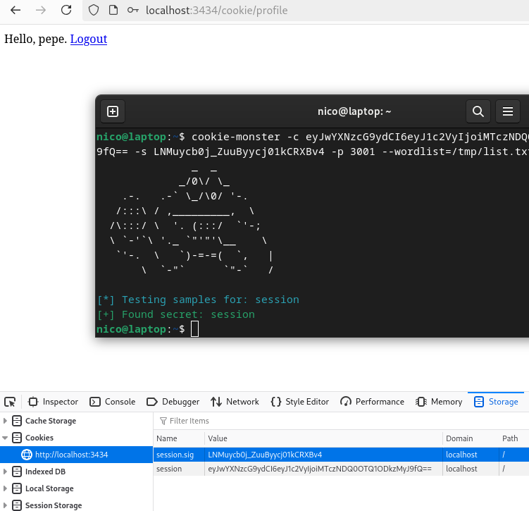
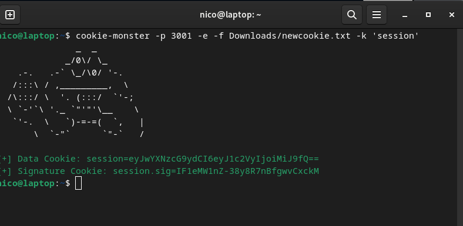

# Introducción

Actualmente, una de las principales herramientas para el desarrollo de aplicaciones web es el framework `Express` [[1]](https://expressjs.com/) para `Node.js` [[2]](https://nodejs.org/en).

Este framework destaca por su facilidad de uso y su simpleza a la hora de diseñar aplicaciones. Esta aparente sencillez es eclipsada por todos los aspectos que hay que tener en cuenta a la hora de hacer un despliegue real, en producción.

Como punto de partida para demostrar las experimentaciones descritas a continuación, se puede encontrar un caso práctico *dockerizado* en el repositorio de github [nicoagr/vulnode](https://github.com/nicoagr/vulnode).

# Consideraciones Básicas

De cara a no repetir código y a tener una base inicial, muchas de las aplicaciones que se diseñan usando este framework web se generan mediante la utilidad `express-generator` [[3]](https://expressjs.com/en/starter/generator.html). Esta utilidad está bien, pero hay que tener una serie de detalles en cuenta para garantizar un despliegue seguro.

-   Al usar la utilidad de generación, se establecen como dependencias unas versiones de los paquetes (de *express*, el *engine* de plantillas, etc.) que pueden ser (y son) vulnerables. Por ello, es recomendable ejecutar el comando `npm audit fix --force`. Este comando fuerza la actualización de las dependencias a sus últimas versiones disponibles sin vulnerabilidades conocidas. Eso sí, al forzar la actualización de las librerías, se pueden introducir incompatibilidades con el código actual. Tras la ejecución, se aconseja revisar cuidadosamente el código y comprobar la batería de test para asegurar que no haya cambios conflictivos.

-   Lo más habitual es encontrarse una configuración en la que las aplicaciones sean accesibles a través de un *reverse proxy*, como por ejemplo *nginx*. Para que *Express* procese correctamente la información sobre la IP del cliente y la conexión (por ejemplo, para HTTPS o manejo de sesiones) que llega a través de dichos proxys, se recomienda establecer el parámetro `trust-proxy` adecuadamente [[4]](https://expressjs.com/en/guide/behind-proxies.html). De este modo, *Express* confiará en las cabeceras `X-Forwarded-*` proporcionadas por el proxy y desconfiará de las cabeceras que intenten suplantarlo. Se modificarán valores internos y las APIs para la información del cliente (como `req.ip`) serán accesibles directamente desde la aplicación node.

-   Para reducir vectores de ataque y divulgaciones de información interna, se recomienda establecer la variable de entorno `NODE_ENV` a `PRODUCTION`. De esta forma, *Express* (y muchas otras librerías) desactivan funciones de depuración y muestran menos detalles en mensajes de error, disminuyendo la información disponible para potenciales atacantes. Además, se habilitan optimizaciones y se desactivan características propias del modo de desarrollo, incrementando la eficiencia y seguridad de la aplicación.

-   Con el objetivo de mitigar vulnerabilidades web comunes, se recomienda el uso de las siguientes extensiones:

    -   `helmet` [[5]](https://www.npmjs.com/package/helmet): Ajusta las cabeceras HTTP para proteger frente a ataques como XSS, clickjacking, embedding y otros.

    -   `cors` [[6]](https://www.npmjs.com/package/cors): Gestiona las políticas de intercambio de recursos entre distintos orígenes, evitando fugas de información a dominios no autorizados.

    -   `xss` [[7]](https://www.npmjs.com/package/express-xss-sanitizer): Ayuda a mitigar la inyección de código malicioso (XSS) limpiando las entradas de usuario.

    -   `hpp` [[8]](https://www.npmjs.com/package/hpp): Previene la contaminación de parámetros HTTP (HTTP Parameter Pollution), garantizando que los parámetros de entrada del usuario no sean manipulados con carácteres especiales.

-   Para proteger frente a ataques cuyo objetivo es sobrecargar los recursos del sistema, se recomienda emplear *middlewares* para hacer un *rate-limiting* activo o pasivo. Por ejemplo:

    -   `express-rate-limit` [[9]](https://www.npmjs.com/package/express-rate-limit): Limita el número de peticiones que un cliente puede realizar en un periodo de tiempo dado. Si se sobrepasa este límite, las peticiones adicionales se bloquean temporalmente.

    -   `express-slow-down` [[10]](https://www.npmjs.com/package/express-slow-down): En lugar de bloquear, introduce retrasos en las respuestas cuando el cliente realiza más peticiones de las permitidas, reduciendo la velocidad de respuesta en lugar de cortar el acceso por completo.

Estas consideraciones se encuentran implementadas en el fichero [app.js](https://github.com/nicoagr/vulnode/blob/master/app.js) en el repositorio previamente mencionado.

# Función *eval()*

Una práctica de seguridad que se desea recalcar con especial atención es el uso de la función `eval()` para conversiones entre tipos y evaluaciones dinámicas.

Con un poco de prisa y sin prestar atención a lo que se quiere hacer, un ojo inexperto puede llegar a cierto tipo de búsquedas en foros especializados [[11]](https://stackoverflow.com/a/38524802) [[12]](https://stackoverflow.com/a/1843399) y utilizar `eval()` para hacer conversiones entre tipos. Esto en sí no es un problema, pero se puede llegar a convertir en uno si no se regula el input del usuario y se permiten ejecuciones directas.

Véase el siguiente ejemplo en el que se está recibiendo un input del usuario para hacer una acción y se está convirtiendo el string obtenido a tipo JSON mediante la función `eval()`.

```
    router.post('/', (req, res) => {
        try {
            const parsedJson = eval(`(${req.body})`);
            // do something with parsedJson
            res.status(200).send('OK');
        } catch (error) {
            res.status(400).send('Invalid input format');
        }
    });
```

A pesar de todas las protecciones establecidas en la Sección [2](# Consideraciones Básicas), el mal uso de esta función puede llegar a ser peligroso si se puede llegar a hacer una petición `POST`, por ejemplo, mediante *fetch* desde la consola del navegador y de la siguiente manera para llegar a ejecutar código en la máquina de la víctima.

```
    fetch('http://localhost:8888/eval/', {
      method: 'POST',
      headers: {
        'Content-Type': 'application/json'
      },
      body: JSON.stringify({
        fruit: 
         "require('child_process').exec('touch /tmp/test')"
      })
    })
```

Aquí, el comando `touch /tmp/test` puede llegar a ser reemplazado con cualquier otro comando, siendo la vulnerabilidad expuesta de tipo **Remote Code Execution** ([CWE-94](https://cwe.mitre.org/data/definitions/94.html)).

En la aplicación provista anteriormente, se pueden llegar a ejecutar comandos en el contenedor docker virtualizado haciendo la petición `POST` en la ruta `/eval`.

# Cookies Mal Protegidas en el Cliente

Puede haber ocasiones en las que un programador decida guardar datos de sesión y/o autenticación en las cookies del cliente (en lugar de guardarlas del lado del servidor). A priori, siempre que estas cookies estén encriptadas y/o contengan datos asociados de autenticación (tags) esta es una buena práctica.

Pero, en muchos de los casos, no se presta la atención que se debiera a la configuración de las cookies. Según un estudio [[13]](https://research.digitalinterruption.com/2018/06/04/are-your-cookies-telling-your-fortune/) realizado en el 2018, el 72.58% de los despliegues realizados usando el middleware de express `cookie-session` tenían como clave secreta de encriptación `secret key`.

Para ver cómo explotar esta vulnerabilidad, supóngase un caso en el que se está usando el citado middleware (podría ser cualquier otro) y una clave secreta insegura en una aplicación de autenticación simple (en el ejemplo concreto desplegado, en la ruta `/cookie/`). Se pueden llegar a utilizar herramientas tales como *cookie-monster* [[14]](https://github.com/DigitalInterruption/cookie-monster) para llegar a extraer la clave secreta de autenticación (el tag) por fuerza bruta e incluso iniciar sesión con otros usuarios. En la siguiente Figura se puede llegar a ver un ejemplo de un *crackeo* de una cookie.



Entonces, una vez se consigue la clave secreta, se puede generar una nueva firma con datos arbitarios y manipular las cookies en una configuración *a la carta*. Por ejemplo, usando *cookie-monster*, se puede observar una codificación con la clave secreta `secret` en la siguiente Figura.



Una modificación de cookies por parte del usuario puede llegar a suponer un riesgo significativo para la seguridad, ya que permite evadir controles, violar políticas de acceso, comprometer información sensible y generar comportamientos no deseados dentro de la aplicación.

La vulnerabilidad expuesta en este ejemplo es la relativa a **Inadequate Encryption Strength** ([CWE-326](https://cwe.mitre.org/data/definitions/326.html))

En conclusión, se recalca la necesidad de leer la documentación y pararse a configurar en condiciones las distintas configuraciones que se utilicen dentro de las librerías en dentro del framework `express`.

Para más información acerca de la vulnerabilidad de manipulación de cookies, se recomienda consultar el informe realizado por DigitalInterruption [[13]](https://research.digitalinterruption.com/2018/06/04/are-your-cookies-telling-your-fortune/).
